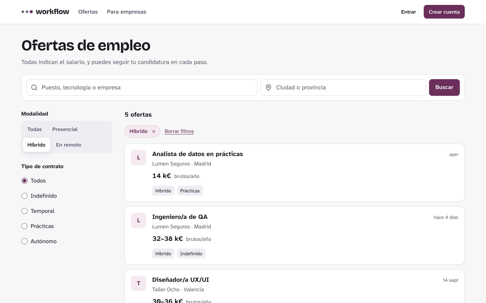
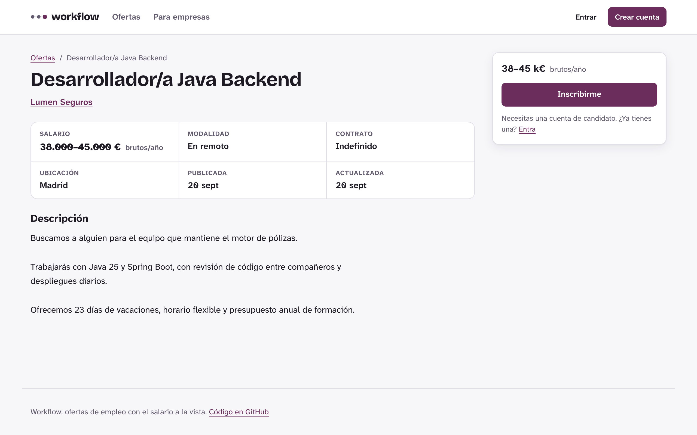
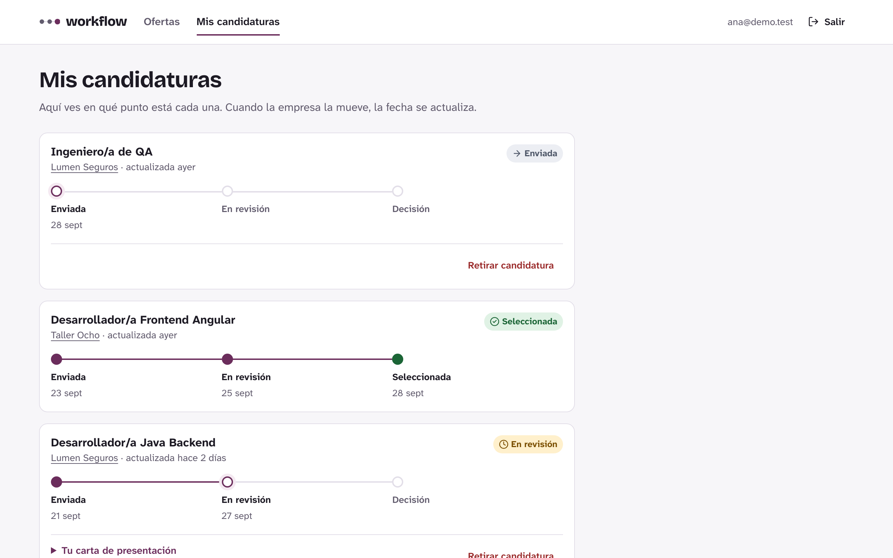
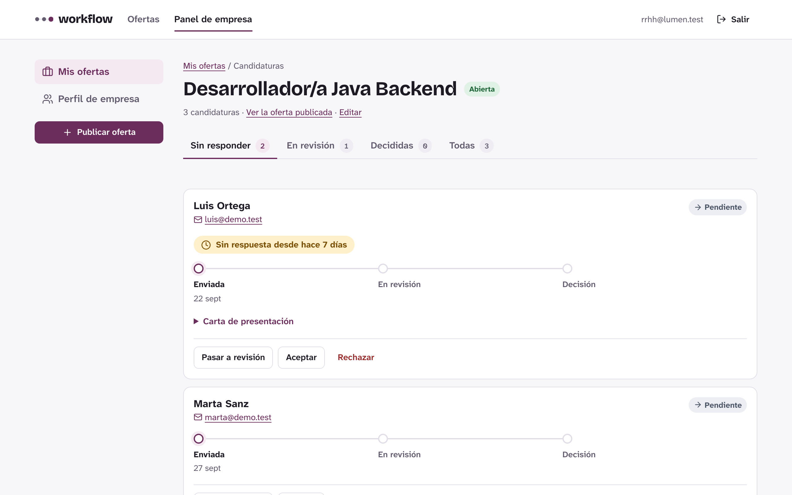
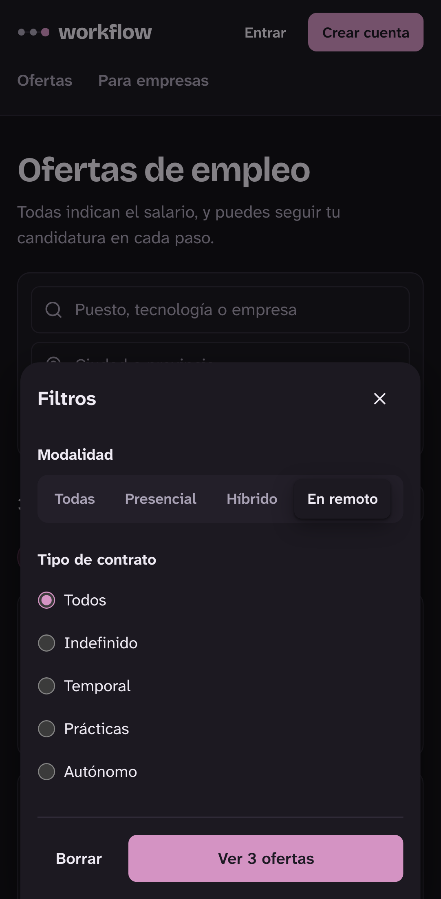

# workflow

[](https://github.com/AlvaroMembrillo/workflow/actions/workflows/backend.yml)
[](https://github.com/AlvaroMembrillo/workflow/actions/workflows/frontend.yml)
[](https://github.com/AlvaroMembrillo/workflow/actions/workflows/e2e.yml)

Portal de empleo desarrollado con Spring Boot y Angular. Todas las ofertas indican el salario y cada
candidato ve en qué punto está su candidatura, con la fecha de cada paso.

## Pruébalo en un comando

Solo necesitas Docker:

```bash
docker compose -f docker-compose.demo.yml up --build
```

Abre http://localhost:8000. La demo arranca con 6 empresas, 15 ofertas y candidaturas en todos los
estados. Estas cuentas tienen la contraseña `demo-workflow`:

| Cuenta | Tipo | Qué ver |
|---|---|---|
| `ana@demo.test` | Candidata | Mis candidaturas: una en revisión, una seleccionada, una no seleccionada y una enviada. En "Mi cuenta", su currículum |
| `rrhh@lumen.test` | Empresa | Panel de Lumen Seguros: la oferta de Java tiene candidaturas pendientes, una con 7 días de espera, y el currículum de cada candidato |
| `luis@demo.test` | Candidato | Una candidatura retirada |

Los correos que envía la aplicación (confirmar el email, cambiar la contraseña, avisos de candidaturas)
no salen a internet: se recogen en http://localhost:8026. Si creas una cuenta, el enlace para confirmarla
llega ahí.

La documentación de la API está en http://localhost:8000/swagger-ui.html. Para borrar los datos de la
demo: `docker compose -f docker-compose.demo.yml down -v`.

## Capturas

| Buscador con filtros | Ficha de una oferta |
|---|---|
|  |  |
| **Mis candidaturas** | **Candidaturas recibidas** |
|  |  |

<p align="center">
  
</p>

## Stack

- **Backend:** Java 25, Spring Boot 4, Spring Security (OAuth2 Resource Server), Spring Data JPA, Flyway, MapStruct
- **Frontend:** Angular 22 sin zone.js (signals), formularios reactivos, CSS con variables propias
- **Base de datos:** PostgreSQL 17
- **Tests:** JUnit 5, MockMvc y Testcontainers en el backend; Vitest en el frontend; Playwright y axe-core de extremo a extremo
- **Despliegue:** imágenes Docker multietapa (JRE 25 sin root; nginx con CSP) y Docker Compose

## Desarrollo

Requisitos: Java 25, Node 24 y Docker.

```bash
docker compose up -d                        # PostgreSQL y Mailpit (servidor de correo de pruebas)
cd backend && ./mvnw spring-boot:run        # API en http://localhost:8080
cd frontend && npm install && npm start     # Web en http://localhost:4200
```

- Web: http://localhost:4200 (reenvía `/api` al backend, sin configurar CORS)
- Swagger UI: http://localhost:8080/swagger-ui.html
- Correos enviados por la aplicación: http://localhost:8025

Tests del backend (levantan su propio PostgreSQL con Testcontainers): `./mvnw test`.
Tests del frontend: `npm test`. Más detalles en [frontend/README.md](frontend/README.md).

### Tests de extremo a extremo

Recorren la aplicación en un navegador real contra la demo en Docker: la búsqueda (también en móvil), el
recorrido completo de un candidato (registro, inscripción, seguimiento y retirada), el de una empresa
(revisar y aceptar una candidatura, publicar una oferta), los enlaces que llegan por correo (confirmar el
email, cambiar la contraseña y los avisos, leídos del buzón de la demo) y una auditoría de accesibilidad
WCAG 2.2 AA con axe-core en tema claro y oscuro. Crean sus propios usuarios, así que se pueden repetir.

```bash
docker compose -f docker-compose.demo.yml up --build -d --wait
cd e2e && npm install && npx playwright install chromium && npm test
```

Las capturas de este README salen de la demo recién creada (sin los usuarios de los tests):

```bash
docker compose -f docker-compose.demo.yml down -v && docker compose -f docker-compose.demo.yml up --build -d --wait
cd e2e && npm run capturas
```

## API

Hay dos tipos de cuenta: **candidatos**, que se inscriben en ofertas, y **empresas**, que las publican y
gestionan las candidaturas que reciben. La documentación completa está en Swagger UI.

| Endpoint | Acceso | Descripción |
|---|---|---|
| `GET /api/ofertas` | Público | Ofertas abiertas, paginadas, con filtros `texto`, `ubicacion`, `modalidad`, `tipoContrato` y `empresaId` |
| `GET /api/ofertas/{id}` | Público | Detalle de una oferta |
| `POST /api/ofertas` | Empresa | Publica una oferta (el rango salarial es obligatorio) |
| `PUT /api/ofertas/{id}` | Empresa propietaria | Modifica una oferta |
| `PATCH /api/ofertas/{id}/estado` | Empresa propietaria | Abre o cierra una oferta |
| `GET /api/empresas/{id}` | Público | Perfil de una empresa |
| `GET` y `PUT /api/empresas/me` | Empresa | Perfil de la empresa propia |
| `GET /api/empresas/me/ofertas` | Empresa | Todas sus ofertas, también las cerradas, con cuántas candidaturas tiene cada una en cada estado |
| `POST /api/ofertas/{id}/candidaturas` | Candidato | Se inscribe en una oferta abierta |
| `GET /api/candidaturas/me` | Candidato | Sus candidaturas, el estado de cada una y la fecha de cada paso |
| `GET /api/ofertas/{id}/mi-candidatura` | Candidato | Su candidatura en una oferta, si se ha inscrito |
| `POST /api/candidaturas/{id}/retirada` | Candidato propietario | Retira la candidatura mientras no haya decisión |
| `POST`, `GET` y `DELETE /api/candidatos/me/cv` | Candidato | Sube (PDF, 5 MB como máximo), consulta o borra su currículum; `GET .../cv/fichero` lo descarga |
| `GET /api/ofertas/{id}/candidaturas` | Empresa propietaria | Candidaturas recibidas en una oferta, con filtro opcional `estado` |
| `GET /api/candidaturas/{id}/cv` | Empresa propietaria | Descarga el currículum del candidato de una candidatura recibida |
| `PATCH /api/candidaturas/{id}/estado` | Empresa propietaria | `PENDIENTE` → `EN_REVISION` → `ACEPTADA` o `RECHAZADA` |

Las ofertas abiertas que llevan 60 días sin cambios se cierran solas cada noche, para que el listado no
acumule vacantes que ya no están activas.

El **currículum** es un PDF por candidato que se envía con todas sus candidaturas. Como es un fichero que
sube un usuario, la API comprueba que el contenido empieza como un PDF (no se fía de la extensión), limpia
el nombre y lo entrega siempre como descarga y sin cachés. Solo puede descargarlo la empresa de una oferta
en la que el candidato sigue inscrito; si retira la candidatura o quita el currículum, deja de estar
disponible. No se analiza con un antivirus: en producción convendría pasarlo por ClamAV.

Los errores siguen el formato [Problem Details (RFC 9457)](https://www.rfc-editor.org/rfc/rfc9457), con el
detalle de cada campo cuando falla la validación.

## Autenticación

La API usa **JWT emitidos por el propio backend**. El usuario se registra o inicia sesión y recibe dos cosas:

- un **token de acceso** firmado, que dura 15 minutos y se envía en cada petición con la cabecera
  `Authorization: Bearer <token>`;
- un **token de refresco** en una cookie `HttpOnly`, que dura 30 días y solo sirve para pedir otro token de
  acceso en `/api/auth/refresco`. Así la sesión aguanta recargas y días sin tener que volver a entrar.

| Endpoint | Acceso | Descripción |
|---|---|---|
| `POST /api/auth/registro` | Público | Crea una cuenta de `CANDIDATO` o `EMPRESA` y abre su sesión |
| `POST /api/auth/login` | Público | Abre una sesión si el email y la contraseña son correctos |
| `POST /api/auth/refresco` | Cookie | Devuelve otro token de acceso y el siguiente token de refresco |
| `POST /api/auth/salida` | Cookie | Cierra la sesión: invalida el token de refresco y borra la cookie |
| `POST /api/auth/verificacion` | Público | Confirma el email con el token del enlace enviado por correo |
| `POST /api/auth/verificacion/reenvio` | Token | Envía otro enlace de confirmación |
| `POST /api/auth/recuperacion` | Público | Envía un enlace para cambiar la contraseña olvidada |
| `POST /api/auth/restablecimiento` | Público | Cambia la contraseña con el token del enlace |
| `GET` y `PATCH /api/usuarios/me` | Token | Datos del usuario autenticado y sus preferencias de avisos |
| `POST /api/usuarios/me/password` | Token | Cambia la contraseña indicando la actual |

Para probarlo desde Swagger UI: llama a `/api/auth/login`, copia el `accessToken` y pégalo en **Authorize**.

### Protección contra abuso

- **Límite de intentos.** Tras 5 contraseñas incorrectas seguidas hay que esperar 15 minutos. La cuenta de
  fallos es por email y dirección IP, para que quien prueba contraseñas no deje sin entrar al dueño de la
  cuenta. Además hay topes por IP para iniciar sesión, crear cuentas y pedir correos de recuperación, y
  por destinatario para no usar el portal para bombardear a nadie con correos. Al superarlos la API
  responde `429` con `Retry-After`. Las cuentas se llevan en memoria: valen para una instancia; con
  varias habría que pasarlas a Redis.
- **Email confirmado para publicar e inscribirse.** Una empresa no puede publicar ofertas ni un candidato
  inscribirse hasta confirmar su email (`403`). Navegar, completar el perfil o subir el currículum sí.

### Correo

Al registrarse, el usuario recibe un enlace para confirmar su email. También se envían por correo el
enlace para cambiar una contraseña olvidada y los avisos: a la empresa cuando recibe una candidatura y
al candidato cuando la empresa la pasa a revisión o decide. Los avisos solo se envían a emails
confirmados y se pueden desactivar en "Mi cuenta".

- **Enlaces de un solo uso.** El token es aleatorio (256 bits) y en la base de datos solo se guarda su
  SHA-256, así que leer la base de datos no permite usar los enlaces pendientes. El de confirmación dura
  48 horas y el de contraseña 1 hora; pedir uno nuevo invalida el anterior.
- **El token va detrás de `#`.** El navegador no envía esa parte al servidor, así que no queda en los
  registros de acceso, y la página lo quita de la barra de direcciones al abrirse.
- **Sin pistas para atacantes.** Pedir el cambio de contraseña responde igual exista o no la cuenta.
- **El envío no bloquea.** Los correos salen después de confirmar la transacción y en otro hilo: si el
  servidor de correo está caído, el registro o el cambio de estado funcionan igual. A cambio, un correo que
  falla se pierde (queda en el registro); para garantizar la entrega haría falta una cola persistente.

Para enviar correo real hay que indicar el servidor con `SMTP_HOST`, `SMTP_PORT`, `SMTP_USUARIO`,
`SMTP_PASSWORD`, `SMTP_AUTENTICACION=true` y `SMTP_STARTTLS=true`, el remitente con `CORREO_REMITENTE`
y la dirección de la web con `URL_PUBLICA`, que se usa en los enlaces.

### Decisiones

- **JWT propio en lugar de Keycloak o Auth0.** El proyecto se puede ejecutar sin cuentas ni servicios
  externos, y toda la lógica de seguridad queda visible en el código. La validación de tokens usa el
  OAuth2 Resource Server estándar de Spring, así que migrar a un proveedor externo sería sobre todo
  cambiar configuración (`issuer-uri`).
- **Firma RS256 con claves RSA.** Solo el backend tiene la clave privada; la pública podría publicarse para
  que otros servicios validen los tokens sin poder emitirlos.
- **Token de acceso corto y token de refresco rotatorio.** Un JWT no se puede revocar, así que dura poco.
  El token de refresco es opaco, se guarda como SHA-256 y solo se puede canjear una vez: cada renovación
  entrega el siguiente. Si alguien presenta uno ya canjeado, puede que lo hayan robado, y se cierra toda la
  sesión. Dos pestañas que renuevan a la vez con la misma cookie no cuentan como robo (10 segundos de margen).
- **El token de refresco no es accesible desde JavaScript.** Va en una cookie `HttpOnly`, `Secure`,
  `SameSite=Strict` y con `Path=/api/auth`: un XSS no puede llevársela y solo viaja a los endpoints de
  sesión. La web guarda el token de acceso en memoria, no en `localStorage`.
- **CSRF.** La API se autentica con la cabecera `Authorization`, que el navegador no añade por su cuenta.
  La cookie solo llega a `/refresco` y `/salida`, no se envía desde otras webs (`SameSite=Strict`) y las
  peticiones con un `Origin` que no sea el de la web se rechazan.
- **Cerrar sesión es real.** Salir invalida el token de refresco en el servidor, y cambiar la contraseña
  cierra las sesiones de los demás dispositivos.
- **Contraseñas con BCrypt** mediante `DelegatingPasswordEncoder`, que guarda el algoritmo junto al hash
  para poder cambiarlo en el futuro sin invalidar las contraseñas existentes.
- **Sin pistas para atacantes:** el login responde igual si el email no existe o si la contraseña es
  incorrecta, y el registro no permite crear cuentas `ADMIN`.
- **Roles en el token** (`roles`), convertidos en authorities `ROLE_*` para usar `@PreAuthorize("hasRole('EMPRESA')")`.

### Clave de firma

En el perfil `dev` la clave privada se genera sola la primera vez en `backend/.jwt/` (ignorada por git).
En cualquier otro entorno hay que indicar un fichero PEM (PKCS#8) con la variable `JWT_CLAVE_PRIVADA`;
si no existe, la aplicación no arranca. Para generarlo:

```bash
openssl genpkey -algorithm RSA -pkeyopt rsa_keygen_bits:2048 -out clave-privada.pem
```

Otras variables: `CORS_ORIGENES_PERMITIDOS` (por defecto `http://localhost:4200`) y `COOKIE_SEGURA`
(por defecto `true`; los perfiles `dev` y `demo` la desactivan porque se abren por HTTP en `localhost`).
